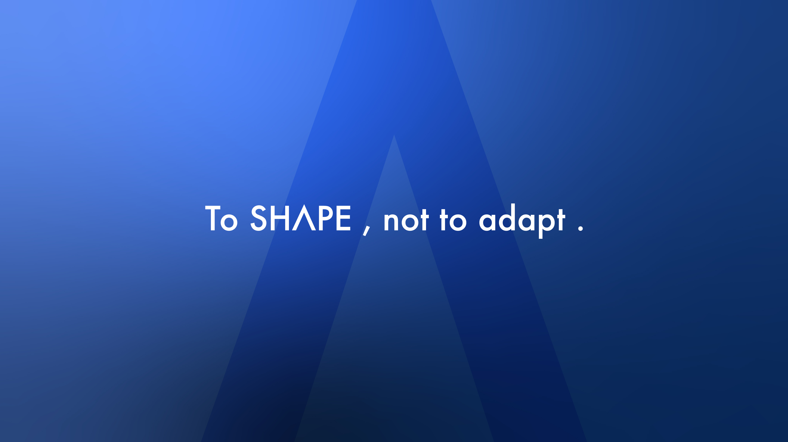

## Theory of Everything

<h1 align="center">Toeverything</h1>

### About Us

Welcome to Toeverything.

We are a passionate team that believes in providing modern web infrastructure tools and solutions, sharing them as open source to promote their development and adoption through the wider community.

### Our Projects

| [AFFiNE](https://github.com/toeverything/affine) | <a href="https://github.com/toeverything/affine" target="blank"><picture style="width: 500px"><source media="(prefers-color-scheme: light)" srcset="images/affine-light-mode.svg" /><source media="(prefers-color-scheme: dark)" srcset="images/affine-dark-mode.svg" /></picture></a> |
| :-: | :-: |
| [BlockSuite](https://github.com/toeverything/blocksuite) | <a href="https://github.com/toeverything/blocksuite" target="blank"><picture style="width: 500px"><source media="(prefers-color-scheme: light)" srcset="images/blocksuite-light-mode.svg" /><source media="(prefers-color-scheme: dark)" srcset="images/blocksuite-dark-mode.svg" /></picture></a> |
| [OctoBase](https://github.com/toeverything/octobase) | <a href="https://github.com/toeverything/octobase" target="blank"><picture style="width: 500px"><source media="(prefers-color-scheme: light)" srcset="images/octobase-light-mode.svg" /><source media="(prefers-color-scheme: dark)" srcset="images/octobase-dark-mode.svg" /></picture></a> |
